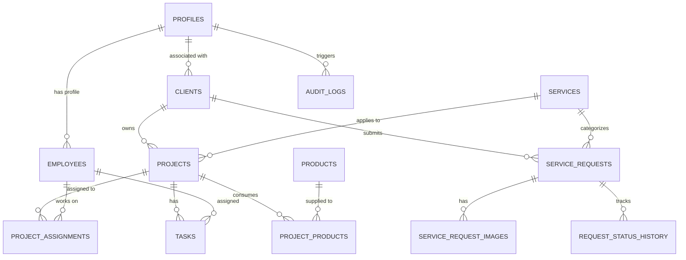

# FAST SERVICES — Enterprise Service Platform & Business Management Suite

<div align="center">


### **FAST ENGINEERING SOLUTIONS**
*Professional Services. Fast Response. Reliable Solutions.*

[](https://nextjs.org/)
[](https://www.typescriptlang.org/)
[](https://tailwindcss.com/)
[](https://supabase.com/)
[](https://web.dev/progressive-web-apps/)
[](https://vercel.com/)

</div>

---

## 📌 Executive Overview

**FAST SERVICES** is a production-ready, full-stack service platform and operations management engine designed for **FAST ENGINEERING SOLUTIONS**. Built for high reliability, responsiveness, and multi-tenant engineering execution, the platform serves industrial factories, commercial facilities, and residential plazas.

The application is engineered with a **mobile-first responsive architecture** (Desktop, Laptop, Tablet, Android, and iOS), is **PWA-ready**, and is configured for seamless deployment on **Vercel** backed by **PostgreSQL / Supabase**.

---

## ⚡ Key Highlights & Core Modules

### 🌐 1. Public Engineering Portal & Direct Actions
- **High-Impact Corporate Homepage**: Dynamic hero, live database-backed services, 4-step execution workflow, and verified trust credentials.
- **Dynamic Services Catalog (`/services`)**: Multi-domain categorization (Electrical, Mechanical/HVAC, Solar EPC, CCTV Surveillance, Automation & SCADA, Industrial Plumbing).
- **Service Scope & Technical Details (`/services/[slug]`)**: Engineering specifications, deliverables checklist, and transparent pricing.
- **One-Touch Communication**:
  - 📞 **Direct Dialer**: `tel:+92XXXXXXXXXX` (opens native phone dialer immediately on mobile).
  - 💬 **Official WhatsApp**: `wa.me/` with pre-filled technical inquiry messages.
  - ✉️ **Corporate Email**: `mailto:` with pre-filled subject and inquiry body.

### 📍 2. Service Booking Engine with GPS & Photo Uploads (`/request`)
- **HTML5 GPS Geolocation**: Explicit "Use My Current Location" button captures precise latitude & longitude with OpenStreetMap / Google Maps linking.
- **Graceful Manual Fallback**: Fully functional manual address entry if location permission is denied.
- **Site Photo Dropzone**: Real-time thumbnail preview, file size/type validation, and instant removal.
- **Automated Request ID**: Generates structured, human-readable IDs (`FS-YYYY-XXXXXX`).

### 👤 3. Customer Service Center (`/dashboard`)
- **Ticket Status Tracker**: Real-time progress counters (`PENDING`, `REVIEWING`, `ACCEPTED`, `ASSIGNED`, `IN_PROGRESS`, `COMPLETED`, `CANCELLED`).
- **Ticket Detail Dossier (`/dashboard/requests/[id]`)**: 6-step visual progress timeline, site location map, photo gallery, and admin technical notes.

### 👷 4. Dedicated Staff & Engineer Workspace (`/employee`)
- **Role-Isolated Portal**: Restricted to `EMPLOYEE`, `MANAGER`, and `ADMIN`.
- **Active Allocations**: View assigned projects, client profiles, and task deadlines.
- **Interactive Progress Controller**: Real-time **0% to 100% completion slider & status updater** that synchronizes instantly with the master Admin Dashboard and project milestone calculations.

### 🏢 5. Enterprise Admin Business Management Suite (`/admin`)
- **Global Month/Year Selector**: Single source of truth calculation engine for all metrics across any selected calendar month.
- **Executive KPI Cards**: Total/Active Clients, Workforce on Site, Active Projects, Month Revenue, Material Costs, Overall Progress %.
- **Project Progress Tracker (`/admin/projects`)**: Visual milestone progress bars, priority badges (`LOW`, `MEDIUM`, `HIGH`, `URGENT`), and task breakdowns.
- **Workforce Allocation Matrix (`/admin/work`)**: Real-time grid mapping `Employee | Client | Project | Task | Status | Progress | Deadline`.
- **Client Dossiers (`/admin/clients`)**: Corporate profiles, contact person details, linked service requests, and project history.
- **Employee & Account Control (`/admin/employees`)**: Role assignments (`ADMIN`, `MANAGER`, `EMPLOYEE`), secure password reset dispatch, and **soft-deactivation safety** to protect historical business records.
- **Products & Material Allocation (`/admin/products`)**: Warehouse inventory control with material consumption logging that automatically deducts stock.
- **Audited Monthly Reporting & Export (`/admin/reports`)**: Unified monthly performance reports with 1-click **CSV** and **PDF** export.
- **Compliance Audit Log (`/admin/activity`)**: Immutable historical trail capturing all administrative changes.
- **Centralized Settings (`/admin/settings`)**: Dynamically update company phone, WhatsApp, email, address, and working hours across the entire platform.

---

## 🛠️ Technology Stack

| Layer | Technology |
| :--- | :--- |
| **Framework** | [Next.js 14](https://nextjs.org/) (App Router, Server & Client Components) |
| **Language** | [TypeScript 5.7](https://www.typescriptlang.org/) (Strict Mode) |
| **Styling** | [Tailwind CSS 3.4](https://tailwindcss.com/) & [Lucide Icons](https://lucide.dev/) |
| **Database & Auth** | [Supabase](https://supabase.com/) / [PostgreSQL](https://www.postgresql.org/) (with Row Level Security & Triggers) |
| **PWA** | Web App Manifest (`manifest.json`) & Service Worker (`sw.js`) |
| **Reporting & Export** | [jsPDF](https://github.com/parallax/jsPDF) & Native CSV Engine |
| **Deployment** | [Vercel](https://vercel.com/) |

---

## 🗄️ Database Architecture (`supabase/schema.sql`)



---

## 🚀 Quick Start Guide

### Prerequisites
- Node.js 18.18+ or 20+
- npm, yarn, or pnpm

### 1. Clone the Repository
```bash
git clone https://github.com/Ainey123/fast-services.git
cd fast-services
```

### 2. Install Dependencies
```bash
npm install --legacy-peer-deps
```

### 3. Setup Environment Variables
Copy `.env.example` to `.env.local`:
```bash
cp .env.example .env.local
```
Configure your credentials in `.env.local`:
```env
NEXT_PUBLIC_SUPABASE_URL=https://your-project-ref.supabase.co
NEXT_PUBLIC_SUPABASE_ANON_KEY=your-anon-public-key
SUPABASE_SERVICE_ROLE_KEY=your-service-role-secret-key

NEXT_PUBLIC_APP_NAME="FAST SERVICES"
NEXT_PUBLIC_COMPANY_NAME="FAST ENGINEERING SOLUTIONS"
NEXT_PUBLIC_SITE_URL=https://fastservices.vercel.app
NODE_ENV=development
```

### 4. Initialize Database Schema (Supabase)
Run the SQL migration script located in [`supabase/schema.sql`](./supabase/schema.sql) in your **Supabase SQL Editor** to establish all tables, sequences, and Row Level Security policies.

### 5. Run the Development Server
```bash
npm run dev
```
Open **[http://localhost:3000](http://localhost:3000)** in your browser.

---

## 🔒 Security & Role-Based Access Control (RBAC)

| Role | Customer Portal (`/dashboard`) | Employee Workspace (`/employee`) | Admin Management (`/admin`) |
| :--- | :---: | :---: | :---: |
| **ADMIN** | Full Access | Full Access | Complete Management & Account Control |
| **MANAGER** | Own Requests | Assigned Projects & Team | Manage Assigned Projects & Tasks |
| **EMPLOYEE** | Own Requests | Assigned Projects & Tasks | Access Denied |
| **CUSTOMER** | Own Requests & Profile | Access Denied | Access Denied |

> [!NOTE]
> **Zero Plain-Text Passwords**: Passwords are handled through cryptographic authentication algorithms and are never stored or displayed to administrators.

---

## 🌐 Production Deployment (Vercel)

1. Import the repository into your [Vercel Dashboard](https://vercel.com).
2. Configure the production environment variables from `.env.example`.
3. Verify that the build command is set to `npm run build`.
4. Click **Deploy**.

---

## 🏢 Corporate Contact

**FAST ENGINEERING SOLUTIONS**  
- 📍 **Headquarters**: Industrial Estate, Sector H-9, Islamabad / Lahore, Pakistan  
- 📞 **Hotline**: +92 300 1234567  
- ✉️ **Inquiries**: info@fastengineeringsolutions.com  
- 🕒 **Hours**: Monday – Saturday: 08:00 AM – 07:00 PM (Emergency 24/7 Dispatch)  

---

<div align="center">
  <sub>© 2026 FAST ENGINEERING SOLUTIONS. All Rights Reserved. Built with Next.js & Supabase.</sub>
</div>
